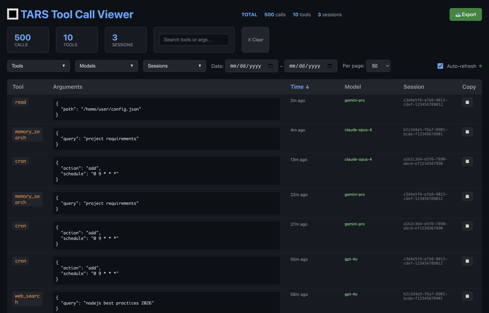

# Tool Call Viewer

Web UI for browsing OpenClaw session tool call history.



## ⚠️ Security Warning

**Do not expose this to the public internet.** Session logs contain your full command history, file paths, API responses, and potentially sensitive data. This tool is designed for **local network use only**.

## Features

- **Dynamic parsing** of JSONL session files
- **Filter by:** date range, tool type (multi-select), session, text search
- **Sort by:** date, tool name, session, model (with toggle direction)
- **Copy rows** as JSON (double-click or 📋 button)
- **Auto-refresh** — poll for new calls every 10 seconds
- **Network accessible** — bind to `0.0.0.0` for LAN access

## Installation

```bash
git clone https://github.com/youruser/toolcallviewer.git
cd toolcallviewer
node server.js
```

No dependencies required — just Node.js.

## Usage

```bash
# Default (port 3847, OpenClaw sessions)
node server.js

# Custom port
node server.js --port 8080

# Custom sessions directory
node server.js --sessions /path/to/sessions

# Show help
node server.js --help
```

Then open http://localhost:3847 (or your machine's IP for LAN access).

## CLI Options

| Option | Short | Description | Default |
|--------|-------|-------------|---------|
| `--port` | `-p` | Port to listen on | `3847` |
| `--sessions` | `-s` | Path to sessions directory | `~/.openclaw/agents/main/sessions` |
| `--help` | `-h` | Show help message | |

## API Endpoints

| Endpoint | Description |
|----------|-------------|
| `GET /` | Web UI |
| `GET /api/tools` | All tool calls as JSON array |
| `GET /api/stats` | Aggregated stats by tool type |

## Running as a Service

### macOS (launchd)

```bash
# Create plist at ~/Library/LaunchAgents/com.toolcallviewer.plist
# Then:
launchctl load ~/Library/LaunchAgents/com.toolcallviewer.plist
```

### Linux (systemd)

```bash
# Create service at /etc/systemd/user/toolcallviewer.service
# Then:
systemctl --user enable toolcallviewer
systemctl --user start toolcallviewer
```

## License

MIT
